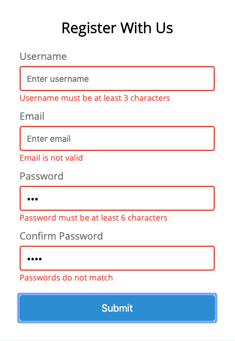

# Vanilla JavaScript Form Validator
A form validator built with HTML, CSS, and 🍦vanilla JavaScript

<!-- 
 -->

## Table of Contents

- [Getting Started](#getting-started)
- [Made with Help of](#made-with-help-of)
- [Author](#author)

## Getting Started

1. Fork or directly clone this repository to your local machine - make sure you are in the project directory `form-validator`
3. Run `npm install` and then `npm start`

## Tech Stack
- [javascript](https://developer.mozilla.org/en-US/docs/Web/JavaScript)
- [css](https://developer.mozilla.org/en-US/docs/Web/CSS)
- [html](https://developer.mozilla.org/en-US/docs/Web/HTML)

## Author

- [Olympia Wojcik](https://github.com/olympiawoj)